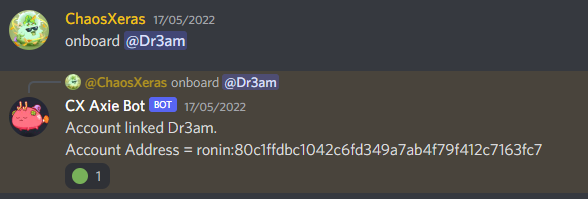

# CX Axie Guild Bot
This is a **Discord** bot that will help you build a guild in Axie Infinity. You can share your assets with your friends and strangers without having the fear of them running away with your assets. The __bot will check if the receiver is under the guild's control before sending assets__. The guild leader will have total control over all assets. The guild leader can grant permissions to others to send axies and breed axies

The bot can help you:
1. Send axies to your scholars account with or without your permission
2. Handle SLP payouts
3. Send Login credentials to guildmates.
4. Report MMR and remaining energy (Special thanks to maxbrand99)
5. Grant permission to users to send axies around / breed
6. Breed Axies
7. Onboard new guildmates

There is a script for those who want to mass generate accounts using seed phrase

# LOOKING FOR TESTERS AND USERS
DM me if you are interested
Discord: chaosxeras#6295

[Twitter](https://twitter.com/CxMaxie)

# Examples 
## Energy & MMR

## Claim SLP

## QR

## Scholar Management

## Send Axies

# Setup
1. Have python v3.8+
2. Run `pip install -r requirements.txt` to install the dependencies
3. Create your own Discord Bot. Provide the bot's token in `config.json` file.
4. Input all configs in `config.json` file using the `example_config.json` template.
5. Provide the discord channel ids of the channels you would like the bot to output the manager logs, scholar bot channel and payout channel.
6. Change `GUILD_NAME_POSTFIX` in `src/models/utils.py` to your guild's symbol.
7. Generate encoded secrets (see below). Add the discord Id associated with each scholar. 
8. Run `./run.sh` for MacOS and `open run.bat` for Windows to run
9. If your bot says _Ready_ in Manager channel, then Congrats! Your bot is live.

## Account generation using seedphrase
1. Input your seedphrase to src/scripts/generate_secrets.py and run using `python src/scripts/generate_secrets.py`
2. Generate the number of ronin wallet addresses you like.
3. Copy paste the accounts into `encoded_secrets.json`. Watch out for duplicates if you provide your own private keys.
4. You can use `src/scripts/generate_one_secret.py` if you are using private key instead.

# Add scholars
1. Populate the account details - private keys and ronin address.
2. Provide the username and password for each account in use.
3. Tie in a guildmate's discord ID to an account. Provide their payout address and discord ID, and which of your account to bind to.

# Help on Discord
Contact me chaosxeras#6295

# How to use bot in chat
## As the guild leader
1. send @ axieId, @user or ronin_address 
    - EG: send@123, @Renzo
    - EG: send@123,ronin:71612ca4bba4d65ef3ef492dc4a4af1782335bca
2. breed @ axieId1 : axieId2 : number_of_times_to_breed 
    - EG: breed@123:431:3
3. morph @ axieId or morph@all
    - EG: morph@655555
    - EG: morph@all
3. claim@slp @user or all
    - EG: claim@slp, @Renzo
    - EG: claim@slp,all
4. energy@person - Displays MMR of person
    - EG: energy @max#1234
    - EG: energy @me
5. mmr@person - Displays MMR of person
    - EG: mmr @max#1234
    - EG: mmr @me
6. recall @user or @ronin_address  - Recalls all axies in account to be sent to the treasury
    - EG: recall@ronin:123123
    - EG: recall @Renzo
7. getpayout @ user
8. changepayout @ ronin_address
9. onboard @user
    - returns error if no free account available
    - returns ronin address of scholar 
        msg = `onboarded @user. scholar account: ronin:address` 
10. offboard @user
    - removes discord ID and payoutAddress associated with user.

## As a guildmate
1. claim@slp
2. changename@:Cupcakes
3. mmr @me or @user
4. energy @me or @user
5. qr @ me
6. changepayout @ new_ronin_address
7. getpayout @ me

# How this bot came about
### TLDR: Axies are great but I miss playing with my friends.

I thought about how nice it would be if there was a way we could share our axies more easily while retaining control. A decentralised guild? A guild where my trusted aids have access to my assets without those assets actually leaving my control.

To handle the load, I had to automate some tasks. Thank you [ZracheSs](https://twitter.com/ZracheSs) for opening my eyes to what web3 can be. The payout bot he created was my gateway to web3. I was hooked to learning how to make transactions using code.

**_"Take a leap of faith and trust others. They might surprise you."_**

## Donations
Ronin Chain - ronin:71612ca4bba4d65ef3ef492dc4a4af1782335bca

ETH - 0xdEd6d55d9F222b09d07C6Cc5ce58c81cfE887B16

# Shoutouts
Special thanks to [FerranMarin](https://github.com/FerranMarin/axie-scholar-utilities). His code has made significant contributions to the open source code.
